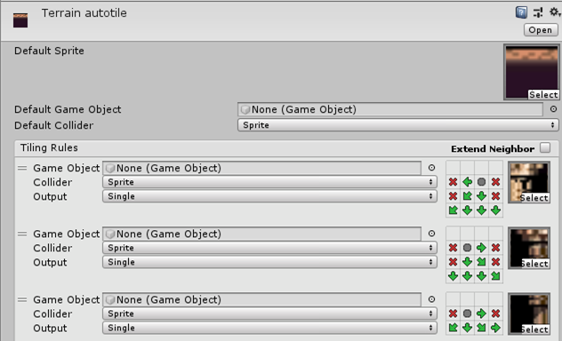

# ColorCycling support for Unity3D (C#)
This project provides integration of LBM files for Unity, via a [custom importer](https://docs.unity3d.com/Manual/ScriptedImporters.html).

### Prerequisites
The project was tested with Unity3D 2019.1 and 2019.2. I would recommend 2019.2+ as the support for 2D is better.

To create the color cycling images, you can use [ProMotion](https://www.cosmigo.com/), but any tool that can export LBM files should suffice.

## Getting Started
Start by cloning the project, inside you will find:
- LBM Library
- Example

## Importing LBMs
Once the CustomImporter is part of the project, LBM files are parsed and imported automatically, generating a prefab you can use. 

The LBM itself is imported as a prefab, and can be dragged onto the scene.

The color cycling is obtained by combining:
* A SpriteRenderer, containing all or a section of the indexed image
* An Animator (IndexedTextureAnimator), controling the animation control and interpolation (if desired)
* A Material, used to render the indexed image in combination with a palette

# Using Sprites
Optionally, there is an Atlas image file available, initially containing the whole image as a single sprite, but it can be splitted and tiled as with classical sprites.

You can now replace the sprites in the SpriteRenderer of the prefab, and create variants. These sprites can be used in sliced / tiled mode, at the cost of having `Full-Rect` contours.

## Multiple animations
If you want to use more than one instance of the same LBM, you have to consider about animation control, controlled via the Inspector.
* If a given sprite animation can stopped/started independently, and maybe run at different speeds, its IndexedTextureAnimator should have `AnimationControl=Individual` (each will have their own Material)
* for synchronized animations (via a single material), select one of the prefabs to be `AnimationControl=SharedMaster`, and the remaining `AnimationControl=SharedSlave`.

# Tilemaps
## Working with tiles
As Most of the work is done with an animated material, this is compatible with animated tilemaps and sprite animations (sprite swaps). There is no need to assign an `IndexedTextureAnimator` if the material is being animated elsewhere.

## Autotiling
Autotiling is not supported by default in Unity, but it can be achieved using [Unity 2D extras](https://github.com/Unity-Technologies/2d-extras) (repository included directly in the example, as Git submodules can be problematic). With this add-on, you will be able to create `rule tiles`.

Rules are created based on adjacency. To know more about rule tiles and other types of tiles and brushes, please refer to the official repository [Unity 2D extras](https://github.com/Unity-Technologies/2d-extras).

As long as the animated Material is assigned to the Tilemap Renderer, the result will be animated (in play mode).

# Usage and Contribution

Feel free to use it, I would be glad to hear more people are using this type of technology. If you have a request, or you would like to contibute, you can contact me at Twitter [@JoanSolRoo](https://twitter.com/JoanSolRoo).

## Acknowledgments
* The example image (and the inspiration to do this work) belongs to [@MrCamonio](https://twitter.com/MrCamonio).
* This was done by simply implementing the [Wikipedia entry for LBM](https://en.wikipedia.org/wiki/ILBM), thanks to the people that took the time to document the format.
* [Unity 2D extras](https://github.com/Unity-Technologies/2d-extras)  is included for simplicity (as git tends to break with submodules). It certainly does not belongs to me.

## License
This project is licensed under the MIT License - see the [LICENSE.md](LICENSE.md) file for details

## References
* [Wikipedia LBM format reference](https://en.wikipedia.org/wiki/ILBM)
* [Mark Ferrari insanely rich scenes](http://www.effectgames.com/demos/canvascycle/)
* [jtsiomb colorcycle viewer (C)](https://github.com/jtsiomb/colcycle)
* [Unity 2D extras](https://github.com/Unity-Technologies/2d-extras) 
